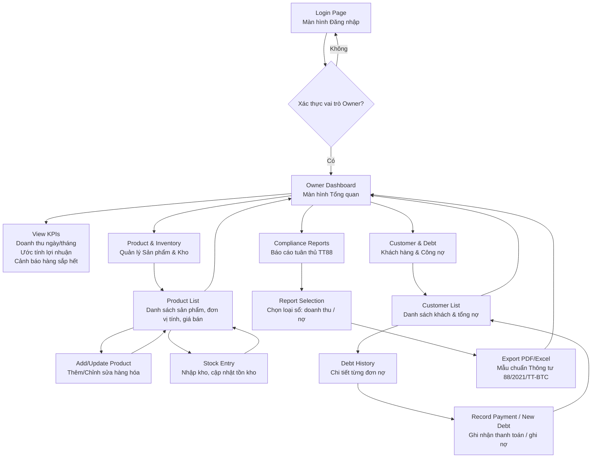

## Luồng màn hình Manager/Owner (BizFlow - Simple Version)

### Mục tiêu
Luồng màn hình dành cho **Manager/Owner** tập trung vào quản lý vận hành hàng ngày, theo dõi hiệu quả kinh doanh và xuất báo cáo tuân thủ theo Thông tư 88/2021/TT-BTC.[1]

***

### 1. Màn hình Đăng nhập (Login Page)
- Manager nhập tài khoản và mật khẩu.  
- Hệ thống xác thực vai trò **Owner** và chuyển hướng vào **Owner Dashboard**.[1]

***

### 2. Màn hình Tổng quan (Owner Dashboard)
- Hiển thị các chỉ số nhanh: doanh thu ngày/tháng, ước tính lợi nhuận, cảnh báo hàng sắp hết.  
- Menu điều hướng đến: **Kho hàng**, **Khách hàng & Nợ**, **Báo cáo thuế/tuân thủ**.[1]

***

### 3. Màn hình Quản lý Sản phẩm & Kho  
*(Inventory & Product Management)*

- **Product List**: Danh sách sản phẩm, đơn vị tính, giá bán.  
- **Add/Update Product**: Thêm mới hoặc chỉnh sửa thông tin hàng hóa.  
- **Stock Entry**: Ghi nhận nhập kho để cập nhật tồn kho thực tế.[1]

***

### 4. Màn hình Quản lý Khách hàng & Công nợ  
*(Customer & Debt Management)*

- **Customer List**: Danh sách khách hàng thân thiết, lịch sử mua hàng và tổng nợ hiện tại.  
- **Debt Tracking**: Xem chi tiết từng khoản nợ, ghi nợ và ghi nhận thanh toán.[1]

***

### 5. Màn hình Báo cáo Tuân thủ  
*(Compliance Reporting – Thông tư 88)*

- **Ledger List / Report Selection**: Chọn loại sổ cần xuất (Sổ chi tiết doanh thu, Sổ nợ).  
- **Export PDF/Excel**: Tự động tạo và tải báo cáo theo mẫu chuẩn Thông tư 88/2021/TT-BTC.[1]

***

### 6. Bảng step-by-step điều hướng màn hình

| Từ màn hình          | Hành động của Manager                         | Đến màn hình / Kết quả                                   |
|----------------------|-----------------------------------------------|----------------------------------------------------------|
| Login Page           | Đăng nhập tài khoản Owner                    | Owner Dashboard                                          |
| Owner Dashboard      | Chọn "Quản lý sản phẩm"                      | Product & Inventory List                                 |
| Product List         | Chọn "Nhập kho"                              | Stock Entry Form (Cập nhật số dư tồn kho)               |
| Owner Dashboard      | Chọn "Quản lý khách hàng"                    | Customer List (Xem nợ tổng và lịch sử mua hàng)         |
| Customer List        | Chọn một khách hàng cụ thể                   | Debt History (Xem chi tiết từng đơn nợ, ghi nợ/thanh toán) |
| Owner Dashboard      | Chọn "Báo cáo sổ sách"                       | Tax/Compliance Report Selection                          |
| Report Selection     | Chọn "Xuất sổ doanh thu" (hoặc sổ nợ)        | Tải file PDF/Excel chuẩn Thông tư 88                    | [1]

***

### 7. Điểm khác biệt so với luồng Admin

- **Tập trung nghiệp vụ vận hành**: Manager làm việc trực tiếp với dữ liệu bán hàng, tồn kho và báo cáo tài chính; Admin tập trung vào cấu hình hệ thống và quản trị tài khoản.[1]
- **Tính tuân thủ & auto-bookkeeping**: Manager có quyền dùng tính năng “Auto-Bookkeeping” để hệ thống tự hạch toán vào sổ cái từ giao dịch hàng ngày.[1]
- **Quản lý nhân viên**: Manager có thể tạo và quản lý tài khoản nhân viên bán hàng (Employee) trong phạm vi hộ kinh doanh của mình.[1]

***

### 8. Ẩn dụ nghiệp vụ

Luồng Manager/Owner giống như **chủ một gian hàng** trong khu chợ:  
- Biết chính xác còn bao nhiêu hàng (Kho & Sản phẩm).  
- Biết ai đang nợ tiền và lịch sử mua (Khách hàng & Công nợ).  
- Cuối kỳ có sẵn **sổ cái kỹ thuật số** để nộp cho cơ quan thuế mà không cần thuê kế toán chuyên nghiệp.[1]

***

## Wireframe Mermaid – Manager/Owner Screen Flow

Nếu bạn muốn, có thể bổ sung thêm nhánh **quản lý nhân viên (Employee Management)** vào khu vực Owner Dashboard để sát hơn với nghiệp vụ tạo/quản lý tài khoản nhân viên bán hàng.[1]

[1](https://mermaid.ai/open-source/syntax/examples.html)